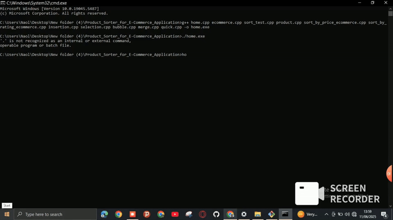

<p align="center">
  
</p>

<h1 align="center">🛍️ Product Sorter for E-Commerce Application 🛍️</h1>

<p align="center">
  
  
  
  
</p>

<p align="center">
  <b>A visually engaging C++ console application for e-commerce product sorting and sorting algorithm comparison.</b>
</p>

<p align="center" style="font-size:1.2em; color:#555;">
  <i>"The best way to learn algorithms is to see them in action!"</i>
</p>

<p align="center">
  
</p>

<hr/>

## 📚 Table of Contents
- [Overview](#-overview)
- [Project Highlights](#-project-highlights)
- [Features](#-features)
- [Demo](#-demo-gif)
- [Screenshots](#-screenshots)
- [How to Run](#-how-to-run)
- [Contributors](#-contributors)
- [License](#-license)

<hr/>

## 🌟 Overview
This project is a mini-project for the Data Structure and Algorithm course at Arba Minch University. It provides a comprehensive solution for managing and sorting product data, alongside a dedicated module for analyzing the efficiency of different sorting algorithms. The application is designed to be both educational and practical, with a focus on user experience and code clarity.

<hr/>

<details>
<summary><b>✨ Project Highlights (click to expand)</b></summary>

- 🚀 **Interactive Console UI**: ASCII art, menus, and clear navigation.
- 🛒 **E-Commerce Simulation**: Realistic product catalog, sorting, and browsing.
- 🧠 **Algorithm Playground**: Instantly test and compare Insertion, Selection, Bubble, Merge, and Quick Sort.
- ⏱️ **Performance Focus**: Designed for future enhancements with timing and comparison features.
- 👨‍💻 **Team Collaboration**: Built by six contributors, with clear roles and GitHub workflow.
- 🎓 **Educational Value**: Perfect for learning, teaching, and demonstrating DSA concepts.

</details>

<hr/>

## ✨ Features

### 🛒 E-Commerce Application
- **View Products:** Browse a detailed list of available products, including their ID, Name, Description, Price, and Rating.
- **Sort Products by Price:** Efficiently sort the entire product catalog based on price, enabling users to find products within their budget (Merge Sort).
- **Sort Products by Ratings:** Organize products by their customer ratings, highlighting the most popular items (Merge Sort).

### 📊 Sorting Algorithms Test
Explore and compare the performance of fundamental sorting algorithms:
- Insertion Sort
- Selection Sort
- Bubble Sort
- Merge Sort
- Quick Sort

Each algorithm test visually demonstrates the sorting process and, in a future enhancement, will include precise efficiency comparisons (e.g., execution time, number of comparisons/swaps) to aid in understanding their practical performance characteristics.

<hr/>

## 🎥 Demo GIF
<p align="center">
  
  <br>
  <em>Demonstration of the application in action</em>
</p>

<hr/>

## 📸 Screenshots
<details>
<summary><b>Click to expand screenshots gallery</b></summary>

<p align="center">
  
  <br>
  <em>Main Menu - ds1.png</em>
</p>
<p align="center">
  
  <br>
  <em>E-Commerce App Menu - ds2.png</em>
</p>
<p align="center">
  
  <br>
  <em>Product List - ds3.png</em>
</p>
<p align="center">
  
  <br>
  <em>Products Sorted by Price - ds4.png</em>
</p>
<p align="center">
  
  <br>
  <em>Sorting Algorithms Test Menu - ds5.png</em>
</p>
<p align="center">
  
  <br>
  <em>Quick Sort By Price - ds6.png</em>
</p>

</details>

<hr/>

## 🚀 How to Run
To compile and run this application, follow these steps:

1. **Clone the repository:**
    ```bash
    git clone https://github.com/Yobil-Job/Product_Sorter_for_E-Commerce_Application.git
    cd Product_Sorter_for_E-Commerce_Application
    ```
2. **Compile the source files:**
    Ensure you have a C++ compiler (like MinGW/GCC) installed.
    ```bash
    g++ home.cpp ecommerce.cpp sort_test.cpp product.cpp sort_by_price_ecommerce.cpp sort_by_rating_ecommerce.cpp insertion.cpp selection.cpp bubble.cpp merge.cpp quick.cpp -o home.exe
    ```
    *Note: Adjust the compilation command if specific libraries or flags are needed for your environment.*
3. **Run the executable:**
    ```bash
    ./home.exe
    ```

<hr/>

## 👥 Contributors

<p align="center">
  
</p>

<table align="center">
  <tr>
    <td align="center"><b>Eyob Weldetensay</b><br><sub>Project Lead & Architect</sub></td>
    <td align="center"><b>Naol Birhanu</b><br><sub>Communication Lead & Developer</sub></td>
    <td align="center"><b>Yordanos Tekalign</b><br><sub>Algorithm Developer</sub></td>
    <td align="center"><b>Abeje Goshu</b><br><sub>Algorithm Developer</sub></td>
    <td align="center"><b>Yemisirach Girma</b><br><sub>Algorithm Developer</sub></td>
    <td align="center"><b>Kibra Gebretsadkan</b><br><sub>Algorithm Developer</sub></td>
  </tr>
</table>

For detailed contributions, see the [CONTRIBUTIONS.md](CONTRIBUTIONS.md) file.

<hr/>

## 📄 License

This project is licensed under the MIT License. See the [LICENSE](LICENSE) file for details.

<hr/>

<p align="center">
  <b>Made with ❤️ by the DSA Project Team at Arba Minch University</b>
</p> 
