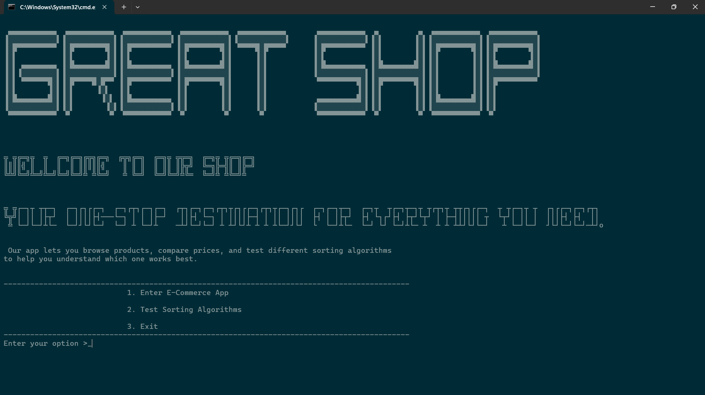
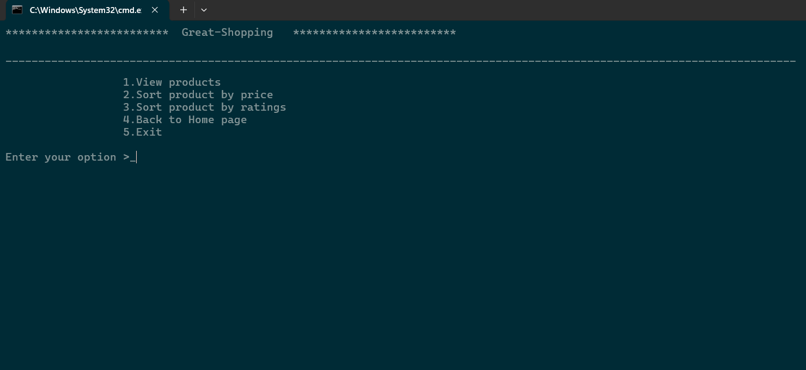
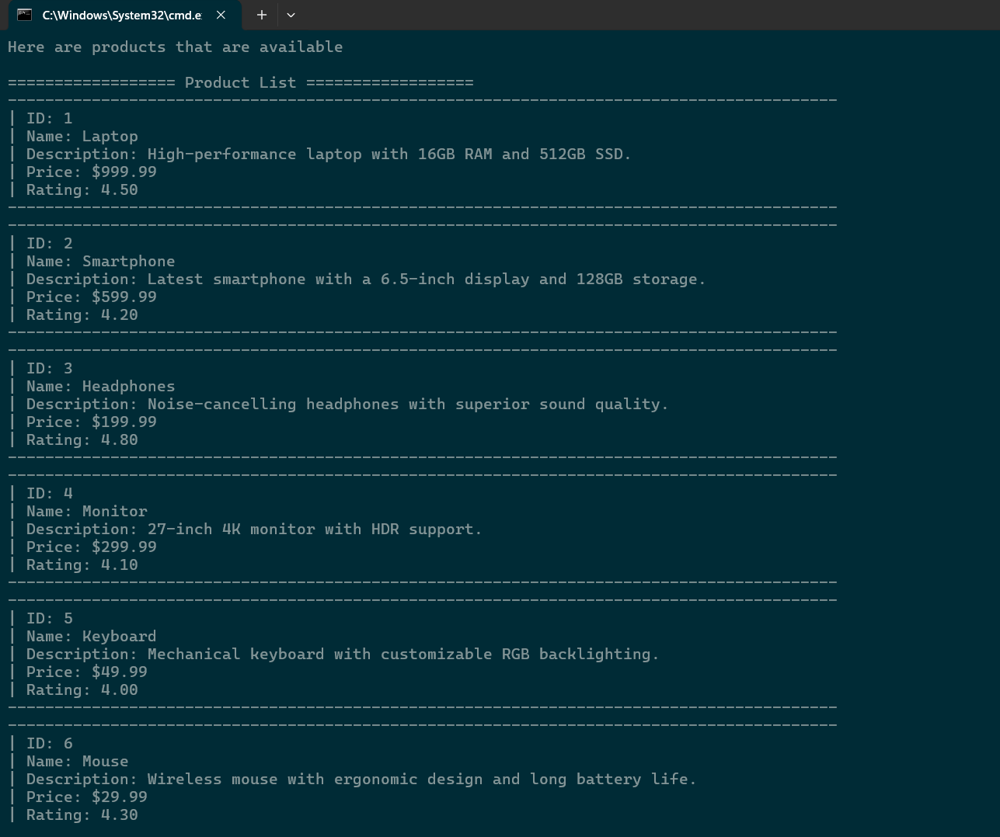
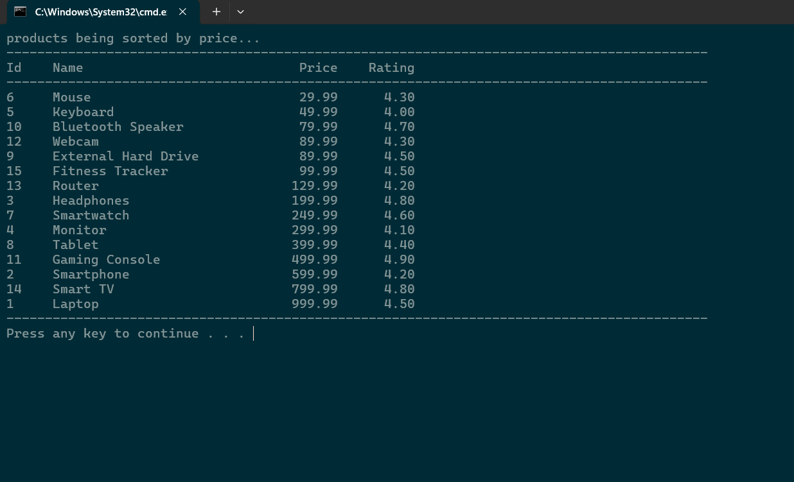
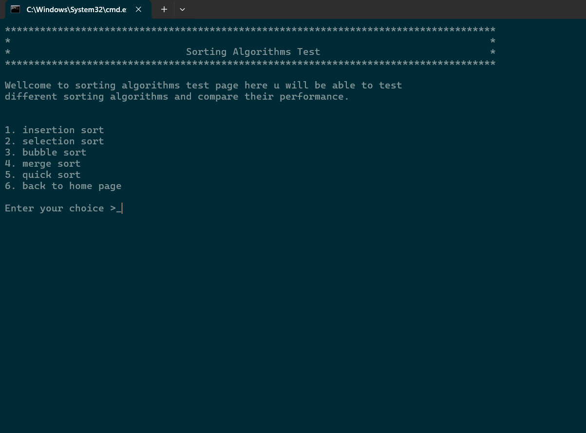
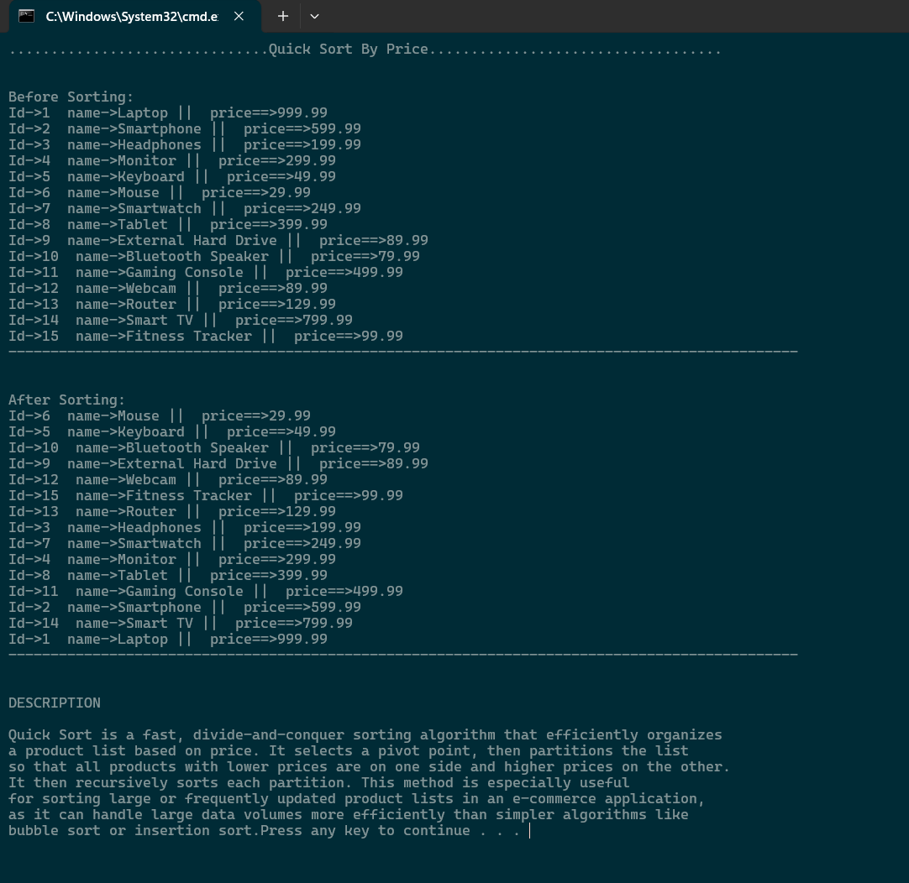

<h1 align="center">🛍️ Product Sorter for E-Commerce Application 🛍️</h1>

<p align="center">
  A C++ console application designed to demonstrate product sorting within an e-commerce context and provide a platform for comparing various sorting algorithms.
</p>

---

## 🌟 Overview
This project serves as a mini-project for the Data Structure and Algorithm course at Arba Minch University. It provides a comprehensive solution for managing and sorting product data, alongside a dedicated module for analyzing the efficiency of different sorting algorithms.

---

## ✨ Features

### 🛒 E-Commerce Application
The e-commerce module offers the following functionalities:
*   **View Products**: Users can browse a detailed list of available products, including their ID, Name, Description, Price, and Rating.
*   **Sort Products by Price**: Efficiently sort the entire product catalog based on price, enabling users to find products within their budget(Merge).
*   **Sort Products by Ratings**: Organize products by their customer ratings, highlighting the most popular items(Merge sort).

### 📊 Sorting Algorithms Test
This section is dedicated to exploring and comparing the performance of fundamental sorting algorithms:
*   **Insertion Sort**
*   **Selection Sort**
*   **Bubble Sort**
*   **Merge Sort**
*   **Quick Sort**

Each algorithm test will visually demonstrate the sorting process and, in a future enhancement, will include precise efficiency comparisons (e.g., execution time, number of comparisons/swaps) to aid in understanding their practical performance characteristics.

---

## 📸 Screenshots
A `screenshots` folder within the project root contains images of the console output, illustrating various stages and functionalities of the application.

<p align="center">
  
  <br>
  <em>Main Menu - ds1.png</em>
</p>
<p align="center">
  
  <br>
  <em> E-Commerce App Menu - ds2.png</em>
</p>
<p align="center">
  
  <br>
  <em>Product List - ds3.png</em>
</p>
<p align="center">
  
  <br>
  <em>Products Sorted by Price - ds4.png</em>
</p>
<p align="center">
  
  <br>
  <em>Sorting Algorithms Test Menu- ds5.png</em>
</p>
<p align="center">
  
  <br>
  <em>Quick Sort By Price - ds6.png</em>
</p>

---

## 🚀 How to Run
To compile and run this application, follow these steps:

1.  **Clone the repository:**
    ```bash
    git clone https://github.com/Yobil-Job/Product_Sorter_for_E-Commerce_Application.git
    cd Product_Sorter_for_E-Commerce_Application

    ```
2.  **Compile the source files:**
    Ensure you have a C++ compiler (like MinGW/GCC) installed.
    ```bash
    g++ home.cpp ecommerce.cpp sort_test.cpp product.cpp sort_by_price_ecommerce.cpp sort_by_rating_ecommerce.cpp insertion.cpp selection.cpp bubble.cpp merge.cpp quick.cpp -o home.exe
    ```
    *Note: Adjust the compilation command if specific libraries or flags are needed for your environment.*
3.  **Run the executable:**
    ```bash
    ./home.exe
    ```

 Here is a **short summary** of your project based on the latest `README.md` content:

---

### 🧾 Project Summary

**Product Sorter for E-Commerce Application** is a C++ console-based project developed as part of the Data Structures and Algorithms course at Arba Minch University. It allows users to view and sort products by price and rating, and includes a module to test and compare five classic sorting algorithms (Insertion, Selection, Bubble, Merge, and Quick Sort). The application emphasizes both practical sorting functionality in an e-commerce context and algorithmic learning through interactive demonstrations.

---


    
